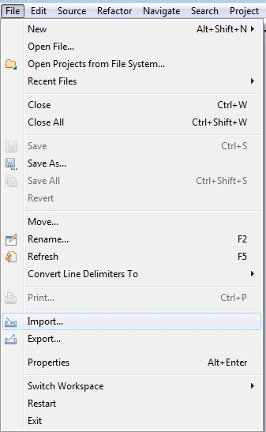

# Comunicación cliente/servidor
Aplicación cliente servidor para adivinar un número secreto almacenado en el servidor

## Instalación 
Importar proyecto en IDE de Java

Eclipse:  

Netbeans:  

## Ejemplo de uso   
Ejecutar Servidor.java y Cliente.java como aplicación de java 
  
  

## Configuración de desarrollo
Requiere instalación de Java 8.

## META
Noelia  ue57656@edu.xunta.es
Distributed under the CreativeCommons by-nc license. See https://creativecommons.org/licenses/by-nc/2.0/es/  for more information.
