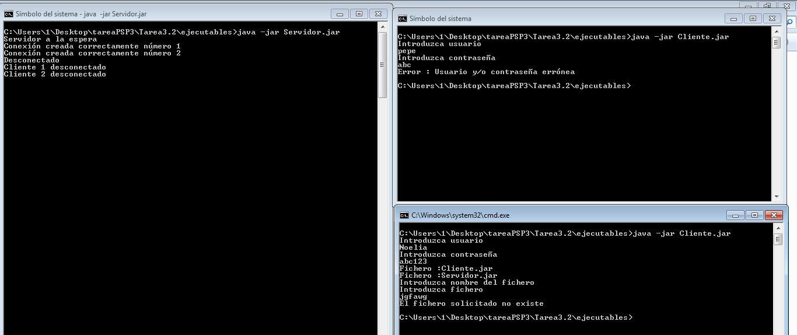
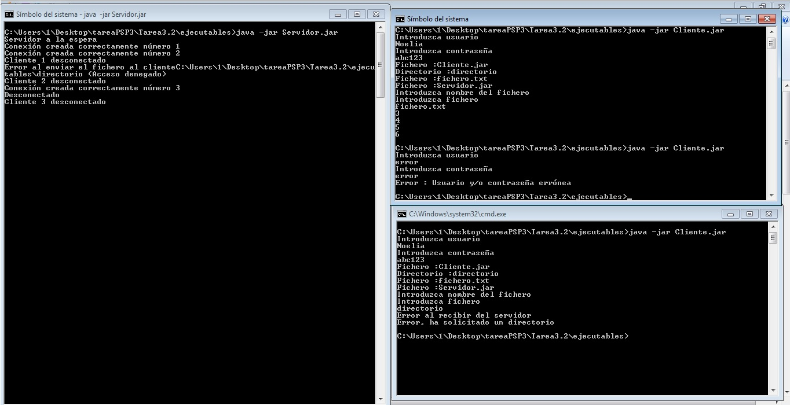

# Envío de datos de un fichero por Sockets
Aplicación concurrente cliente servidor con permiso de usuario, muestra de un directorio, y envío del contenido de un fichero

## Instalación 
Importar proyecto en IDE de Java

Eclipse:

Netbeans:  

## Ejemplo de uso   
Ejecutar Servidor.java y varios Cliente.java como aplicación de java: 
  
  

## Configuración de desarrollo
Requiere instalación de Java 8.

## META
Noelia  ue57656@edu.xunta.es
Distributed under the CreativeCommons by-nc license. See https://creativecommons.org/licenses/by-nc/2.0/es/  for more information.
